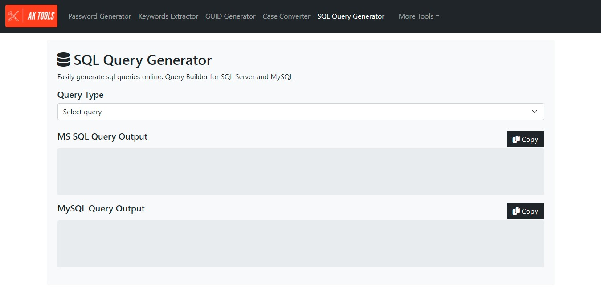

# sql-query-generator

Easily generate common SQL queries

  <kbd>
    
  </kbd>

## Description

This easy-to-use query tool can be use to easily generate common SQL Server and MySQL queries using the uery builder form. 

### Features

- SELECT Queries
- INSERT Queries
- UPDATE Queries
- DELETE Queries
- CREATE Queries
- RENAME Queries
- DROP Queries
- MySQL Queries
- MS SQL Queries

### Built with

- Javascript
- HTML + CSS

### Demo

- [aktools.net/sql-query-generator/](https://aktools.net/sql-query-generator/)

## Getting started

### Install

All you have to do is download the source files, no configurations needed. Place the the files somewhere on your system and open the `index.html` file located at: `\sql-query-generator\index.html`

### Usage

Simply select the Query Type then enter the Enter Query Information. Yo can then copy the generated query to clipboard by clicking the Copy button.

### See also

- [password-generator](https://github.com/akassama/password-generator)
- [keywords-extractor](https://github.com/akassama/keywords-extractor)
- [guid-generator](https://github.com/akassama/guid-generator)
- [case-converter](https://github.com/akassama/case-converter)
- [text-notepad](https://github.com/akassama/text-notepad)
- [jquery-character-counter](https://github.com/akassama/jquery-character-counter)
- [bootstrap-search-autocomplete](https://github.com/akassama/bootstrap-search-autocomplete)
- [jquery-datables-crud](https://github.com/akassama/jquery-datables-crud)
- [bootstrap-search-autocomplete](https://github.com/akassama/bootstrap-search-autocomplete)
- [akassama-projects](https://github.com/akassama/projects)

### License

This project is licensed under the [MIT License](https://opensource.org/licenses/MIT).